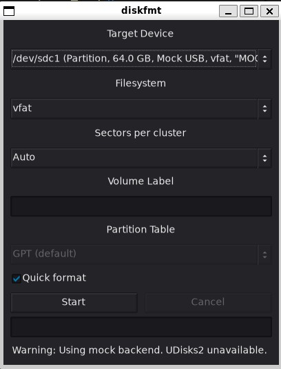

# diskfmt
A disk formatting utility for linux that is similar to the windows format utility.
Currently it uses the UDisks2 system service (via the `udisks2` crate) for the heavy lifting. Other backends can be conceptually added later.

## Raison d'etre
Small, good defaults and easy to use, especially for users coming from windows to linux.

## Screenshot



## Notes
If you need to be able to create exfat partitions, you need to install exfatprogs package on your distribution if not already available.

## Intentional policies
- Filters non-removable devices (to avoid accidents).
- Defaults to GPT tables when choosing a block device. MBR can still be chosen from the UI.
- When choosing a block device, diskfmt will still create a partition and format it.
- Defaults to exfat if available (falling back to vfat, ext4, etc.), since it's writable with no extra permissions and supports large files.

## Build dependencies
FLTK build deps:
- libx11-dev
- libxext-dev
- libxft-dev
- libxinerama-dev
- libxcursor-dev
- libxrender-dev
- libxfixes-dev
- libpango1.0-dev (will install libcairo devel as well)

## Runtime dependencies
- Udisks2 system service.
On a linux system with a desktop environment, the following runtime dependencies are most likely present:
- libX11
- libXext
- libXft
- libXinerama
- libXcursor
- libXrender
- libXfixes
- libcairo
- libpango-1.0

## Building
```bash
git clone https://github.com/MoAlyousef/diskfmt
cd diskfmt
cargo build --release
# if you have libfltk1.4-dev installed, you can build using
cargo build --release --features=fltk/fltk-config
# To build with hybrid/x11 support
cargo build --release --features=fltk/use-wayland
```

Feature flags:
- Default build enables the GUI.
- CLI-only build: `cargo build --release --no-default-features`.
- Accessibility: `cargo build --release --features a11y` (requires GUI feature).

## CLI Usage

diskfmt starts the GUI by default (no arguments) or with `--start-ui`. The same operations are available via a command‑line interface.

Global options:
- `--mock-backend` Use the mock backend (no system changes; useful for testing)
- `--theme THEME` UI color theme (e.g., DARK2) [GUI builds only]
- `--scheme SCHEME` UI widget scheme (Fleet1 or Fleet2) [GUI builds only]

Commands:

- Start GUI
  - `diskfmt` or `diskfmt --start-ui`
  - Apply style: `diskfmt --start-ui --theme DARK2 --scheme Fleet2`

- List devices (removable only)
  - `diskfmt list`
  - With mock: `diskfmt --mock-backend list`

- Format a device or partition
  - `diskfmt format --path <PATH> [--fs <vfat|exfat|ntfs|ext4|xfs|btrfs>] [--label <LABEL>] [--quick] [--size "Auto"|"4096 bytes"|"8 sectors"] [--table <GPT|DOS>]`
  - Notes:
    - `--path` can be a device path (e.g., `/dev/sdb1`) or a UDisks object path. `diskfmt list` prints device paths with details.
    - `--quick` enables a faster (non‑full) format; omit it for a full format.
    - `--size` matches GUI labels. Examples:
      - vfat: `"8 sectors"`, `"16 sectors"`
      - others: `"4096 bytes"`, `"65536 bytes"`
      - `"Auto"` lets the formatter choose.
    - For whole‑disk formatting (not a partition), add `--table GPT|DOS`.
  - Examples:
    - `diskfmt format --path /dev/sdb1 --fs vfat --label USB --quick --size "8 sectors"`
    - `diskfmt format --path /dev/sdb --fs ext4 --label DATA --size "4096 bytes" --table GPT`

- Cancel a running format
  - `diskfmt cancel <JOB_ID>`
  - When a format starts, the CLI prints `Job <ID> started`; use that ID with `cancel`.

- Config management
  - `diskfmt config --print` Print effective theme and scheme (merged: CLI > config > defaults)
  - `diskfmt config --path`  Show the resolved config file path
  - `diskfmt config --edit`  Open the config in `$VISUAL`/`$EDITOR` (creates a template if missing)
  - `diskfmt config --init [--force]` Create or overwrite the config file with a template

### Configuration file

diskfmt reads configuration from:
- `$XDG_CONFIG_HOME/diskfmt/config.toml`, or
- `~/.config/diskfmt/config.toml`

Schema (TOML):

```toml
[style]
# Default GUI theme and scheme
theme = "DARK2"   # See `diskfmt --help` for full list
scheme = "Fleet1" # Fleet1 or Fleet2
```

CLI flags always override config, which overrides built‑in defaults (DARK2 + Fleet1).
